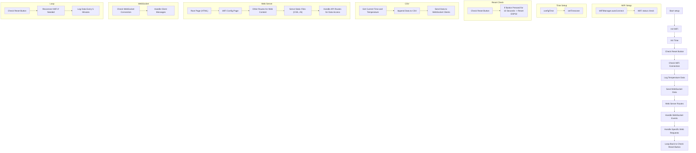

```mermaid
%%{init: {"themeVariables": {"fontSize": "20px"}}}%%
flowchart TD
    A["Start setup"] --> B["Init WiFi"]
    B --> C["Init Time"]
    C --> D["Check Reset Button"]
    D --> E["Check WiFi Connection"]
    E --> F["Log Temperature Data"]
    F --> G["Send WebSocket Data"]
    G --> H["Web Server Routes"]
    H --> I["Handle WebSocket Events"]
    I --> J["Handle Specific Web Requests"]
    J --> K["Loop Back to Check Reset Button"]

    subgraph WiFi Setup
        B1["WiFiManager.autoConnect"] --> B2["WiFi status check"]
    end

    subgraph Time Setup
        C1["configTime"] --> C2["setTimezone"]
    end

    subgraph Reset Check
        D1["Check Reset Button"] --> D2["If Button Pressed for 10 Seconds -> Reset ESP32"]
    end

    subgraph CSV
        F1["Get Current Time and Temperature"] --> F2["Append Data to CSV"]
        F2 --> F3["Send Data to WebSocket Clients"]
    end

    subgraph Web Server
        H1["Root Page (HTML)"] --> H2["WiFi Config Page"]
        H2 --> H3["Other Routes for Web Content"]
        H3 --> H4["Serve Static Files (CSS, JS)"]
        H4 --> H5["Handle API Routes for Data Access"]
    end

    subgraph WebSocket
        I1["Check WebSocket Connection"] --> I2["Handle Client Messages"]
    end

    subgraph Loop
        K1["Check Reset Button"] --> K2["Reconnect WiFi if Needed"]
        K2 --> K3["Log Data Every 5 Minutes"]
    end


```